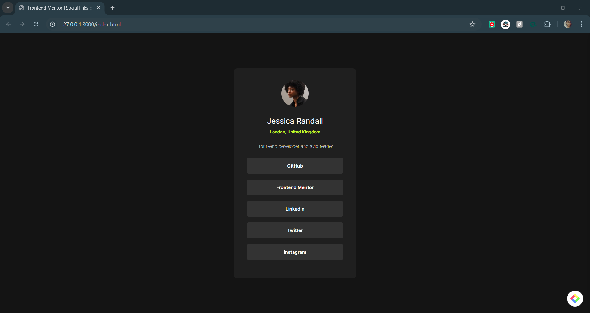

# Frontend Mentor - Social Links Profile Solution

This is a solution to the [Social Links Profile challenge on Frontend Mentor](https://www.frontendmentor.io/challenges/social-links-profile-UG32l9m6d). Frontend Mentor challenges help you improve your coding skills by building realistic projects.

## Overview

### The Challenge

Users should be able to:

- View the optimal layout of the social links profile card depending on their device's screen size.
- See hover and focus states for interactive elements.

### Screenshot




### Links

- [Live Site URL](https://pavanimankonda.github.io/Social-Links-Profile/)

## My Process

### Built With

- Semantic HTML5 markup
- CSS custom properties
- Flexbox
- Mobile-first workflow

### What I Learned

During this project, I refined my skills in responsive design using Flexbox and improved hover effects for better user interaction.

#### Example Code:

```css
.links div: hover {
    color: hsl(0, 0%, 8%);
    background-color: hsl(75, 94%, 57%);
}
```

### Useful Resources

- [MDN Web Docs](https://developer.mozilla.org/)—comprehensive documentation on HTML, CSS, and JavaScript.
- [CSS Tricks](https://css-tricks.com/) - Great for learning advanced CSS techniques.

## Author

- Frontend Mentor - [@pavanimankonda](https://www.frontendmentor.io/profile/yourusername)

## Acknowledgments

Thanks to the Frontend Mentor community for providing great challenges that enhance coding skills!

